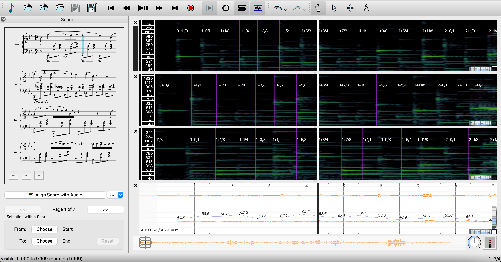

CAAMP: Computer-assisted Annotation and Analysis of Music Performance
================

### *Performance Precision* is a software application that assists analyzing recorded music performances together with their scores.

*Performance Precision* is adapted from [Sonic Visualiser](https://github.com/sonic-visualiser/sonic-visualiser), but with an added panel displaying musical scores, and additional features such as audio-to-score alignment. Its interface is designed to help streamline the processes of loading a digital score and a performance recording, editing and visualizing annotations, and exporting score-aware annotations.

*Performance Precision* needs to be used together with Vamp aligner plugins that can conduct audio-to-score alignment. Existing releases already include a default plugin, [piano aligner](https://github.com/yucongj/piano-aligner). For anyone who would like to develop new aligner plugins for *Performance Precision*, please refer to the later section [Developing Vamp aligner plugins](#developing-vamp-aligner-plugins).

 
This project is supported by the National Endowment for the Humanities through a Digital Humanities Advancement Grant.

------

## How to use *Performance Precision*

### Loading a score
Go to the File menu and select Choose Score (or select the musical note icon at the upper left corner). The score file format must be [MEI](https://music-encoding.org).

### Loading a recording
Go to the File menu and select Open Recording (or select the second icon from the upper left corner).

### Loading another recording (optional)
Go to the File menu and select Open Another Recording (or select the third icon from the upper left corner).

### Aligning score with audio
Click on the "Align Score with Audio" button underneath the rendered score. This will trigger the selected aligner plugin to conduct audio-to-score alignment. The estimated onsets will be displayed in the same pane as the spectrogram. Choose "Accept Alignment" if you think the result is an acceptable starting point for further manual refinements (see [Correcting alignments](#correcting-alignments)); otherwise, choose "Reject Alignment" and consider conducting alignments section by section via [partial alignments](#partial-alignments).

To see all installed aligner plugins and select among them, click on the dropdown arrow besides the alignment button. One of the items in this dropdown menu, "Smart Copy from First Recording", can be used only when there is more than one recording loaded—see [Smart copying alignments](#smart-copying-alignments) for more details.

### Correcting alignments

If estimated onsets are misaligned with the actual performance, you can correct them easily by dragging the onset indicators. Make sure you are in the Editing mode when doing so; you may switch between the Navigation mode (default) and the Editing mode by toggling between the number keys "1" and "3".

Some helpful features:

* Automatically highlighted notes in the score and text labels representing the position of selected notes
* As the onsets are edited, the tempo curve is updated in real time. 
* Toggle on onset clipping sound (default on).
* The slowdown feature (the speed dial at the lower right corner).

### Exporting and importing alignments
To export alignments, go to the File menu and choose Save Score Alignment As (or select the sixth icon from the left). The first column in the saved CSV file contains score times and the second column contains onset timestamps in seconds. A score time is represented by a text label specifying the measure number and the position within the measure. For
example, the label “1+0/1” stands for the beginning of the first measure, and the label “1+3/4” stands for after three quarter notes worth of time in the first measure; the latter score position is highlighted in the image at the top.

To import alignments, go to the File menu and choose Load Score Alignment (or select the fourth icon from the left). The imported CSV file needs to have two columns containing score times and onset times.

### Partial alignments

To align only one section of the score, select a region in the score and select the corresponding region in the recording before requesting alignments. You may select a score region via the two Choose buttons beneath the rendered score. To select a recording region, first switch to the Select mode by pressing the number key "2", and then use your cursor to paint a region in the recording area (you may press the Escape key to cancel a selection).

The partial alignment feature is especially useful when the whole recording of a score is not available, or when one is interested in analyzing only a particular section. Exported alignment files from partial alignments still contain all the score labels, and the ones outside of aligned regions would have "NA'' as their onset times.

### Smart copying alignments

When there are multiple recordings of the same piece loaded into the software, one can "smart copy" existing alignments from the first recording to the other recordings. When the alignments in the first recording are correct, the copied alignments in a receiving recording usually are more accurate than those generated from an aligner plugin. Therefore, the smart copy feature can help reduce the amount of work of correcting alignments.

To use this feature, click on the dropdown arrow besides the alignment button (the same place for selecting all aligner plugins) and select "Smart Copy from First Recording". The text of the alignment button will automatically change to "Smart Copy from First Recording". Activate the recording intended to receive the copied alignments and then press the alignment button.

You may also smart copy only one section of the score. To do so, just select a score region (like in partial alignments) before pressing the alignment button.

### Limitations

* Grace notes are currently omitted.
* The software currently supports annotations only about timing (note onsets and tempo).

## Developing Vamp aligner plugins

Start by cloning the [dummy score aligner](https://github.com/yucongj/dummy-score-aligner) repository. Make sure you can run the build script before implementing your audio-to-score alignment algorithm in the function `DummyAudioToScoreAligner::align()`. It may be helpful to look at the implementation of the default aligner plugin in *Performance Precision*, [piano aligner](https://github.com/yucongj/piano-aligner), which adopts the classic hidden Markov model from [Raphael](https://ieeexplore.ieee.org/document/761266).

If you're not yet familiar with developing Vamp plugins, please refer to the [Vamp website](https://vamp-plugins.org/develop.html) which contains detailed documentations.

Your plugin should provide the alignment result to the host (*Performance Precision*) via an output with the identifier "audio-to-score-alignment" (already specified in `DummyAligner.cpp`).

Your plugin needs to parse and represent scores in the same way as the host. The code is already provided in `Score.h` and `Score.cpp`. A score is represented as a sequence of `MusicalEvent`s, containing each event's score time information and note information, etc. When an MEI score is loaded to the host, the host processes the score (using `verovio`) and writes out some intermediate files for both the host and the plugin to further parse the score. These intermediate files have the file extensions such as `.solo` and `.meter`, and they will be automatically deleted when the score is unloaded. Both the host and the plugin then parse these files to represent the score.

